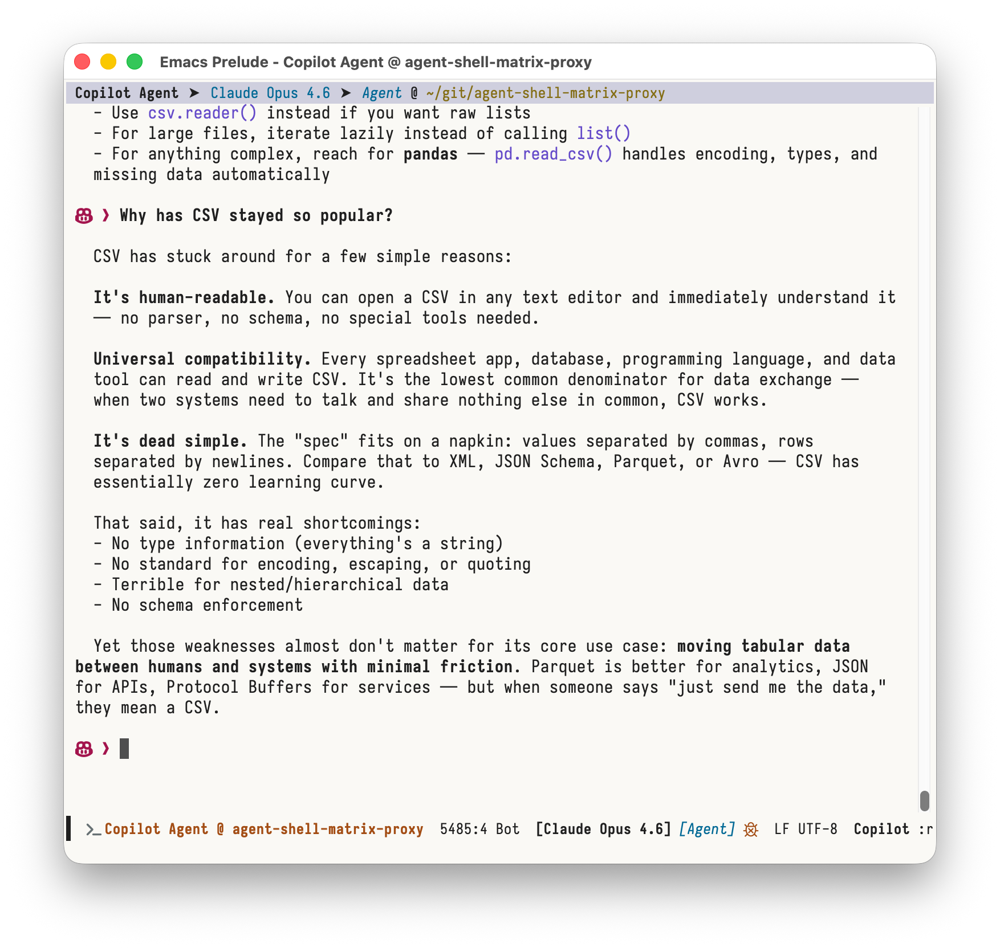
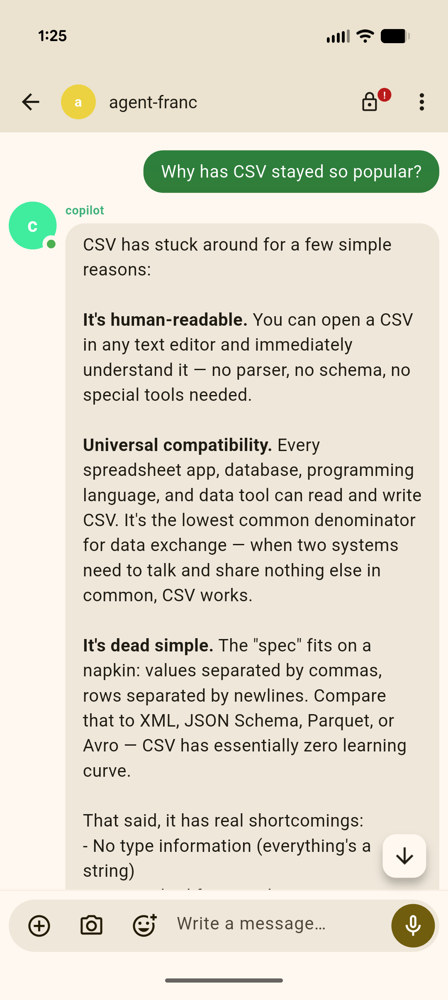

#+title: Agent Shell Matrix Proxy
#+author: Edd Wilder-James

A Matrix bot that relays [[https://github.com/xenodium/agent-shell][agent-shell]] sessions between Emacs and Matrix, enabling mobile/web access to your AI coding sessions.

Start an agent-shell session in Emacs, hand it off to Matrix, continue from your phone, then bring it back to Emacs — seamlessly.

#+caption: Conversation in Emacs (left) and on mobile via Element (right)
|  |  |

*⚠️ Experimental:* This works for the author's setup but is not widely
tested. Your mileage may vary. Bug reports and patches welcome.

* Features

- *Bidirectional relay* — Messages flow between Matrix rooms and agent-shell via webhooks
- *Session handoff* — Transfer active sessions between Emacs and Matrix
- *Remote commands* — Control agent-shell mode and model from Matrix (=!plan=, =!autopilot=, =!model=, etc.)
- *Rate-limited sends* — Message coalescing prevents Matrix 429 rate limits
- *Session tracking* — SQLite-backed with TTL-based auto-return
- *E2E encryption* — Optional end-to-end encryption with device verification
- *User whitelist* — Only authorized Matrix users can interact

* Architecture

#+begin_example
  Emacs (agent-shell)
      ↕ HTTP webhooks
  Matrix Proxy Bot (Python, matrix-nio)
      ↕ Matrix protocol
  Matrix Homeserver → Element (phone/web)
#+end_example

The bot runs as a Python service alongside your Matrix homeserver. Emacs
communicates via HTTP webhooks; Matrix users interact in dedicated rooms.

* Prerequisites

- Python 3.13+
- [[https://docs.astral.sh/uv/][uv]] — Python package manager
- A Matrix homeserver with a bot account

* Setup

** 1. Clone and install

#+begin_src bash
git clone https://github.com/ewilderj/agent-shell-matrix-proxy
cd agent-shell-matrix-proxy
uv sync
#+end_src

** 2. Configure

#+begin_src bash
cp .env.example .env
#+end_src

Edit =.env= with your settings:

| Variable            | Description                                   |
|---------------------+-----------------------------------------------|
| =MATRIX_HOMESERVER=   | Your homeserver URL (e.g. =https://eddpod.com=) |
| =MATRIX_BOT_USER_ID=  | Bot account (e.g. =@copilot:eddpod.com=)        |
| =MATRIX_BOT_PASSWORD= | Password for first login (removed after)      |
| =WEBHOOK_SECRET=      | Shared secret for webhook auth                |
| =ALLOWED_USERS=       | Comma-separated Matrix user IDs to whitelist  |
| =LOG_LEVEL=           | Logging level (default: =INFO=)                 |

** 3. First run

#+begin_src bash
uv run matrix_proxy_bot
#+end_src

On first run with password, the bot prints an access token and device ID.
Add these to =.env=:

#+begin_src conf
MATRIX_ACCESS_TOKEN=syt_xxx...
MATRIX_DEVICE_ID=ABCD123
#+end_src

Remove =MATRIX_BOT_PASSWORD= and restart.

** 4. Optional: E2E encryption

Install build dependencies, then sync with the =e2e= extra:

#+begin_src bash
# macOS
brew install libolm cmake autoconf automake libtool
# Linux
sudo apt-get install libolm-dev cmake build-essential libssl-dev

uv sync --extra e2e
#+end_src

The bot bootstraps cross-signing keys automatically. See [[file:IMPLEMENTATION.org][IMPLEMENTATION.org]]
for details on the encryption architecture.

* Emacs Integration

The file =agent-shell-matrix-handoff.el= provides the Emacs side. Load it
in your init:

#+begin_src emacs-lisp
(load "~/git/agent-shell-matrix-proxy/agent-shell-matrix-handoff.el")
#+end_src

** Configuration

#+begin_src emacs-lisp
(setq agent-shell-matrix-bot-url "http://127.0.0.1:8765")
(setq agent-shell-matrix-webhook-port 9999)
(setq agent-shell-matrix-webhook-host "127.0.0.1")
(setq agent-shell-matrix-webhook-secret "your-webhook-secret")
#+end_src

** Usage

In any =agent-shell= buffer:

| Command                        | Action                         |
|--------------------------------+--------------------------------|
| =M-x agent-shell-matrix-handoff= | Hand current session to Matrix |
| =M-x agent-shell-matrix-return=  | Bring session back to Emacs    |

When you hand off, the bot creates a private Matrix room (named
=#agent-{hostname}-{number}=), invites your whitelisted users, and posts
recent conversation context. Messages typed in Matrix are relayed to
agent-shell; responses flow back to the room.

** Capabilities

The handoff automatically sends available modes and models from your
agent-shell session. These become dynamic =!= commands in Matrix (see
below).

* Matrix Commands

In an active session room, type =!help= to see all available commands.

** Built-in commands

| Command | Description                   |
|---------+-------------------------------|
| =!status= | Show session info and TTL     |
| =!help=   | List all available commands   |
| =!return= | Hand session back to Emacs    |
| =!close=  | Archive and close the session |

** Dynamic mode commands

Mode commands are populated from your agent-shell configuration. Typical
modes:

| Command    | Description              |
|------------+--------------------------|
| =!plan=      | Switch to Plan mode      |
| =!agent=     | Switch to Agent mode     |
| =!autopilot= | Switch to Autopilot mode |

The current mode is shown with a =●= marker in =!help= output. Mode
changes are sent to Emacs and take effect immediately.

** Model commands

| Command       | Description                                |
|---------------+--------------------------------------------|
| =!model=        | Show current model                         |
| =!model <name>= | Switch to a model (supports partial match) |

Model matching is flexible — =!model sonnet= matches =claude-sonnet-4-20250514=,
for example. If your query is ambiguous, the bot tells you.

* HTTP API

The bot exposes an HTTP API for programmatic access:

| Endpoint           | Method | Description           |
|--------------------+--------+-----------------------|
| =/handoff=           | POST   | Initiate session      |
| =/webhook/message=   | POST   | Relay message to room |
| =/session/{room_id}= | GET    | Query session status  |
| =/sessions=          | GET    | List active sessions  |

All endpoints require =Authorization: Bearer <webhook-secret>=.

** Handoff request

#+begin_src json
{
  "session_id": "abc-123",
  "hostname": "myhost",
  "webhook_url": "http://localhost:9999/webhook",
  "webhook_secret": "secret",
  "quiet_mode": false,
  "ttl_seconds": 14400,
  "available_modes": ["Plan", "Agent", "Autopilot"],
  "current_mode": "Agent",
  "available_models": ["claude-sonnet-4-20250514", "gpt-4o"],
  "current_model": "claude-sonnet-4-20250514"
}
#+end_src

** Webhook message

#+begin_src json
{
  "room_id": "!abc:server.com",
  "session_id": "abc-123",
  "response_text": "Here is the answer...",
  "format": "markdown",
  "formatted_body": "
Here is the answer...
"
}
#+end_src

* Session Lifecycle

1. *Handoff* — Emacs calls =/handoff=; bot creates/reuses a room, stores session
2. *Active* — Messages relay bidirectionally; =!= commands available
3. *Return* — User types =!return= or Emacs calls =agent-shell-matrix-return=
4. *Expiry* — Sessions auto-return after TTL (default 4 hours)
5. *Close* — =!close= archives the session

Sessions are keyed by =session_id=. Handing off the same session reuses
the existing room.

* Rate Limiting

The bot uses a per-room send queue with message coalescing:

- Messages within a 100ms window are merged into a single send
- A 500ms minimum interval between sends per room
- Prevents Matrix 429 rate-limit errors during fast agent-shell output

* Development

#+begin_src bash
uv sync               # Install dependencies
uv run pytest -v       # Run tests
uv run ruff check src/ # Lint
uv run ruff format src/ # Format
#+end_src

* Database

Sessions are stored in SQLite (=~/.agent-shell-matrix-proxy/sessions.db=).
Schema migrations are applied automatically on startup. No conversation
history is stored — the bot is a stateless relay.

* License

GPL-3.0-or-later
